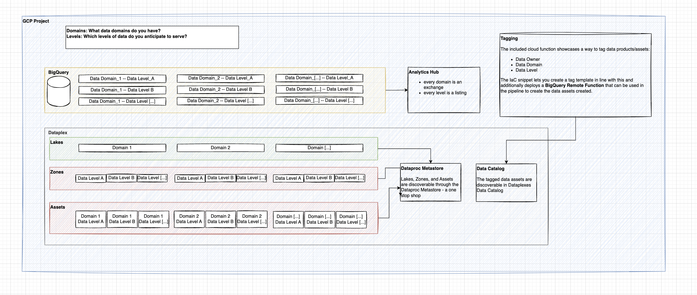

# Readme

Hello and welcome to BI in a Box.

## Description and Goals

BI in a Box helps to set up and deploy a structured cloud data platform that serves the need to implement Business Intelligence on top of it.

This project/repository provides a boilerplate code asset that enables users to deploy a cloud data platform that is ready to be consumed by business intelligence tools and already included in other areas of the cloud platform: data governance, data catalog, etc.
The goal is, to help users jump the first hurdle of setting something seemingly complicated up, see how it works and then enhance the given solution according to their needs.

## Requirements

For this asset to work, the user needs an existing Google Cloud Project with billing activated. A definition of the different data domains (marketing, sales, hr, etc) as well as the decision on data layers/depth should have been concluded already.

## How to use

Before we start, we need to set a few env variables (do not c&p the dollar sign):

```
$ export PROJECT_ID=
$ export ACCOUNT=
$ export TF_SA=
$ export REGION=
$ export CONFIG=
$ export TF_VARIABLEFILENAME=
```

After set, execute the script (Note: this is also creating a gcloud config as per good practice - if not required, remove the first step of the script)

```
$ ./scripts/activate_gcloud.sh
```

The script executes and outputs two commands to be executed as well. Note: these will bring up a browser window that requires the user to authenticate using the account credentials.

In addition to the above, we need a Service Account to be used to run Terraform and APIs need to enabled to get started. The user can do so using the console or through another script.

```
dals;,dasl,
```

If through the console, the required APIs that need to be active are (this is, if the project is fresh - these are likely to be activated already):

```
cloudresourcemanager.googleapis.com
iam.googleapis.com
iamcredentials.googleapis.com
serviceusage.googleapis
```

The service account needs the `Owner` role, and we need to make sure that the account used to execute Terraform with, is allowed to use the service account through being a `Service Account User` and `Service Account Token Creator`.

The above can also be achieved using the script

```
$ ./scripts/prepare_gcp.sh
```

Now that we are set, we need to set the terraform variables in a file

```
$ touch $TF_VARIABLEFILENAME.tfvars
```

with the following variables to set. [Please refer to this link re the dataform specific settings](https://cloud.google.com/dataform/docs/connect-repository)

```
project_id                        = <your project id, should match with env variable PROJECT_ID>,
region                            = <your desired region, should match with env variable REGION>,
data_levels                       = <desired layers of data> Example: ["raw", "staging", "analytical]
data_domains                      = <desired data domains> Example: ["finance", "hr"]
dataform_repository_name          = <dataform repository name>
dataform_remote_repository_url    = <dataform repo on Git> (Currently only Github supported)
dataform_remote_repository_token  = <token required for external dataform reposistory>
dataform_secret_name              = <name of the secret to be created>
dataform_remote_repository_branch = <branch to be used> "main"
tag_templates = [{
  id           = "tag_template1"
  display_name = "tag_template1"
  force_delete = true
  fields = [{
    order       = 1
    id          = "data_owner"
    type        = "STRING" <Thats an example for a string type tag field>
    is_required = true
    }, {
    id           = "data_level"
    display_name = "Data Level"
    order        = 3
    type         = "ENUM" <Thats an example for an enum type tag field>
    values = [
      "source_aligned",
      "transformed",
      "analytical"
    ]
    is_required = true
    },
    {
      order       = 2
      id          = "data_domain"
      type        = "STRING"
      is_required = true
    }
  ]
}]
```

_Important note:_ The tag template here goes 🤝 hand in hand with the cloud function thats being deployed and can be found under `./functions/tagging` - more on that under "Underlying principle"

## How does this work?

For demonstrating purposes, see schema below.

- Define data domains to separate data products by domain
  - Every data domain gets a separate data lake
  - Enables finer permission setting
- Define data levels to define layers of data
  - This simplifies the identification of the state of data
  - Every layer equals one zone


